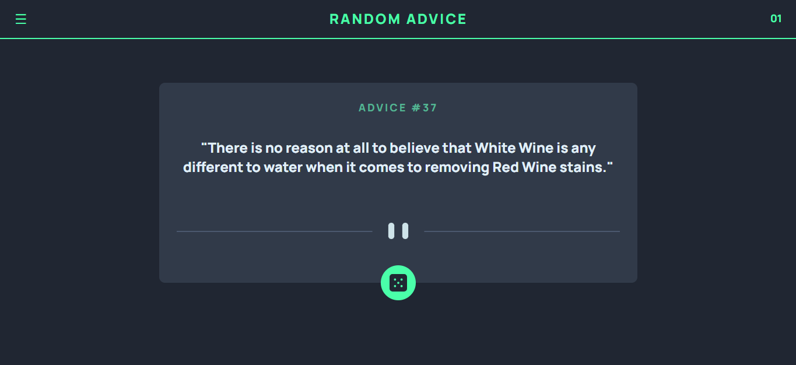
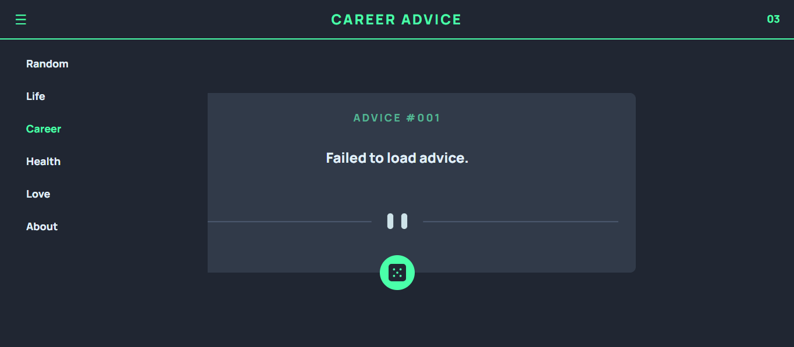

# Advice Generator App

## Hello 👋

Thanks for checking out my advice generator app. This is a solution to the [advice generator app challenge on Frontend Mentor](https://www.frontendmentor.io/challenges/advice-generator-app-QdUG-13db).

### The challenge

Users should be able to:

- View the optimal layout for the app depending on their device's screen size
- See hover states for all interactive elements on the page
- Generate a new piece of advice by clicking the dice icon

### My Own Twist

- Things I added:
  - a menu function
  - page numbering
  - my own advice api for: life, relationships, career, health and finances.
  - an "about" menu content which redirects app visitor to this repository.
    
### Links

- Live Site URL: [Add live site URL here](https://your-live-site-url.com)

## My process

1. Analyzed design
2. Analyzed documentation for 3rd-party API
3. Created a raw spreadsheet to compile advice for my own API
4. Prompted GPT to provide code for random page enabled by a 3rd-party API and template for other pages I will feed with my own API.
5. For my own API, I created a JSON as the standard and another in JS as a hack.
    
### Built with

- HTML
- CSS
- JS
- Chat GPT
  
### Continued development

1. Add a theme toggle to header for users to choose between light and dark
2. Add a notification page for visitors to track updates to app
3. Collaborate with people who want to populate the app or whatnot. If this is you, here is a [form](https://forms.gle/MGAbR1jYESABd8PG8) to indicate your interest :)  

## Author

- Website - [Gbemisola Oyeniyi](https://gbemisolaoyeniyi.wordpress.com)
- Frontend Mentor - [@itsgbemi](https://www.frontendmentor.io/profile/itsgbemi)
- Twitter - [@icecoldalvy](https://www.twitter.com/icecoldalvy)   

**Onto the next** 🚀
